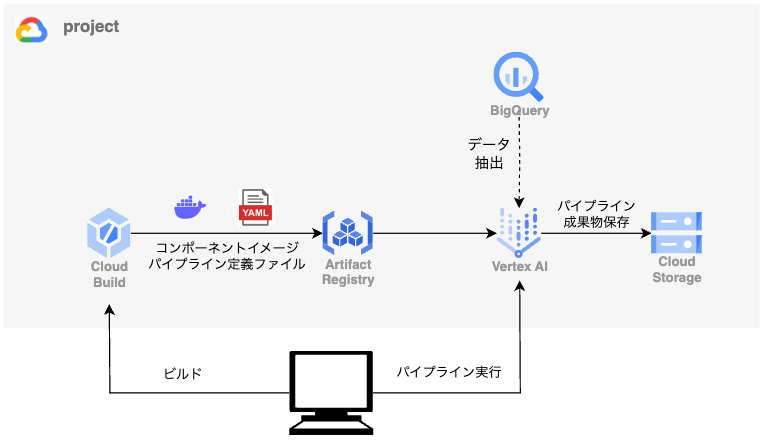
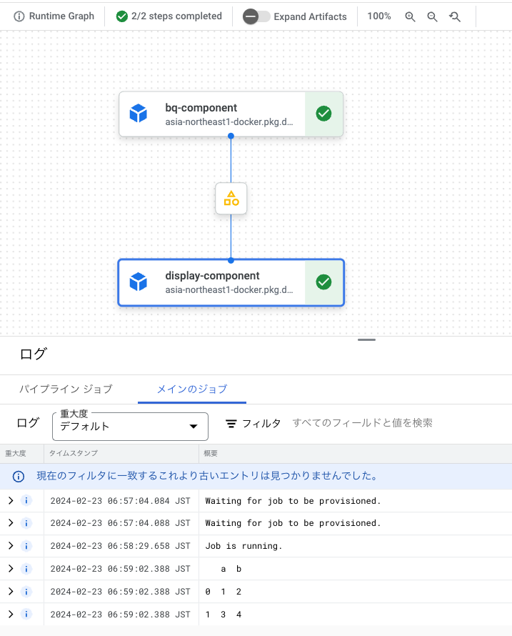

# お題
今回は簡単なパイプラインを作ります．
行なう処理は，Big Queryにあるデータセットからデータを抽出し保存．保存したものを読み取って，printするものです．


# 全体図
Vertex AI Pipelinesにてパイプラインを実行するにあたり，以下のような構成を作っています．

- Cloud Buildにて各コンポーネントのビルドとパイプラインのコンパイル
- Artifact Registryに，ビルドしたコンポーネントのDockerイメージとパイプライン定義ファイルを保存
- ローカルPCから，パイプラインの実行を指示

 


# 開発環境
Pythonを使ってパイプラインを構築します．環境はpyenvとPoetryを用いており，パイプライン作成にあたって，以下メインとなる2つのライブラリをインストールします．

- kfp (^2.0.0) [ドキュメント](https://www.kubeflow.org/docs/components/pipelines/v2/)
- google-cloud-aiplatform [ドキュメント](https://cloud.google.com/python/docs/reference/aiplatform/latest/google.cloud.aiplatform.PipelineJob)


## フォルダ構成
フォルダ構成は以下のようにしています．

<details><summary>フォルダ構成</summary>

  ```shell
  <simple-pipeline>
   ├── .cloudbuild
   │   └── deployment.yaml
   ├── components
   │   ├── bq-component
   │   │   ├── src
   │   │   │   ├── __init__.py
   │   │   │   └── main.py
   │   │   ├── component.yaml
   │   │   ├── dependencies.txt
   │   │   ├── Dockerfile
   │   │   ├── Makefile
   │   │   ├── poetry.lock
   │   │   └── pyproject.toml #(root下pyproject.tomlのシンボリックリンク)
   │   └── display-component
   │       ├── ...
   ├── deployment
   │   ├── build.sh
   │   ├── deployment_component.sh
   │   ├── deployment_pipeline.yaml
   │   └── exec.sh
   ├── pipeline
   │   ├── src
   │   │   ├── __init__.py
   │   │   ├── compile_pipeline.py
   │   │   ├── exec_pipeline.py
   │   │   └── simple_pipeline.py
   │   ├── dependencies.txt
   │   ├── Dockerfile
   │   ├── Makefile
   │   ├── poetry.lock
   │   └── pyproject.toml #(root下pyproject.tomlのシンボリックリンク)
   ├── (.env)
   ├── .gcloudignore
   ├── .gitignore
   ├── poetry.lock
   └── pyproject.toml
  ```

</details>


### ポイントは以下です
- コンポーネントは，閉じた環境で管理できるようにするため，基本的には各ディレクトリを設けて，そこでコードを作っています．
- パイプラインの入出力を定義するため，各コンポーネントのディレクトリには`component.yaml`を設けています．(※ただし，kfp^2.0.0が正式リリースされたことで，今後は使わない方向で考えています([参考](https://tech.layerx.co.jp/entry/2023/11/16/185944#%E3%82%B3%E3%83%B3%E3%83%9D%E3%83%BC%E3%83%8D%E3%83%B3%E3%83%88%E5%AE%9A%E7%BE%A9%E3%81%AE%E6%9B%B8%E3%81%8D%E6%96%B9)))．
- `pipeline/src/simple_pipeline.py`にて，コンポーネント同士のつなぎこみを行なっています．このとき，`@dsl.pipeline()`のように，`kfp`のメソッドをオーバーライドすることで簡単にパイプラインを定義することができます．
- kfp^2.0.0より，パイプラインの定義ファイルをArtifact Registryに格納する機能が搭載されました．これまではGCSに保存していたのですが，Artifact Registryに保存できるようになったことで，バージョン管理ができるようになりました．


# ビルド
ここまで構成できれば，あとはコマンドを実行するだけです．以下コマンドを使って，Cloud Buildにてビルドを行ないます．パイプラインのコンポーネントとなるDockerイメージのビルドと，パイプラインのコンパイルを行なって，成果物をArtifact Registryに格納します．

```bash
#!/usr/bin/env bash
export $(cat .env | xargs)

gcloud builds submit \
    --config .cloudbuild/deployment.yaml\
    --region=asia-northeast1\
	--substitutions=TAG_NAME="${TAG_NAME}",\
_COMPILE_FILE="${COMPILE_FILE}",\
_PIPELINE_NAME="${PIPELINE_NAME}",\
_REGISTRY_PATH="${REGISTRY_PATH}"

```


<details><summary>deployment.yaml</summary>

```yaml
# @format

steps:
  - name: gcr.io/cloud-builders/docker
    entrypoint: bash
    args: ["deployment/deployment_component.sh"]
    env:
      - GCP_PROJECT_ID=${PROJECT_ID}
      - DOCKER_BUILDKIT=1
      - TAG=${TAG_NAME}
    id: Build & push components docker images

  - name: "gcr.io/cloud-builders/gcloud"
    args:
      [
        "builds",
        "submit",
        "--config=deployment/deployment_pipeline.yaml",
        "--region=${LOCATION}",
        "--substitutions=_TAG=${TAG_NAME},\
        _COMPILE_FILE=${_COMPILE_FILE},\
        _PIPELINE_NAME=${_PIPELINE_NAME},\
        _REGISTRY_PATH=${_REGISTRY_PATH}"
      ]
    dir: .
    id: Compile pipeline
options:
  logging: CLOUD_LOGGING_ONLY
```

</details>


# 実行
コンパイルして格納したパイプライン定義ファイルを指定(`registry_template_path`)して，パイプラインを実行します．
```bash
#!/usr/bin/env bash
export $(cat .env | xargs)

poetry run python pipeline/src/exec_pipeline.py \
    --project="${PROJECT_ID}" \
    --location="${LOCATION}" \
    --pipeline_root="${PIPELINE_ROOT}" \
    --registry_template_path="${REGISTRY_PATH}/${PIPELINE_NAME}/${TAG}" \
    --table_id="${TABLE_ID}"
```

`exec_pipeline.py`内で`google-cloud-aiplatform`の`PipelineJob`を実行しています．


<details><summary>exec_pipeline.py</summary>

```python
from google.cloud import aiplatform

...
aiplatform.init(
    project=project,
    location=location,
)

job = aiplatform.PipelineJob(
    display_name="simple_pipeline",
    template_path=template_path,
    pipeline_root=pipeline_root,
    parameter_values={
        "table_id": table_id,
    },
)
job.submit(
    service_account=service_account,
)
...
```

</details>

# 実行結果
以下のようにパイプラインが動き，最終的にデータフレームをプリントしてくれています．


 


# まとめ

本記事では，簡単なパイプラインをVertex AI Pipelinesに構築しました．何番煎じかわかりませんが，普段行なっている業務のアウトプットとして記載しました．

# 参考
- [kfp (^2.0.0)](https://www.kubeflow.org/docs/components/pipelines/v2/)
- [google-cloud-aiplatform](https://cloud.google.com/python/docs/reference/aiplatform/latest/google.cloud.aiplatform.PipelineJob)
- [Vertex Pipelinesによる機械学習パイプラインの実行](https://zenn.dev/dhirooka/articles/71a5fc473baefb)